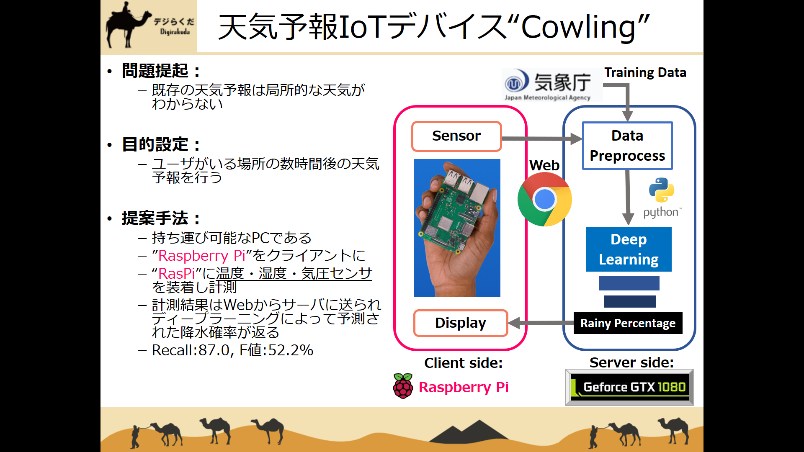
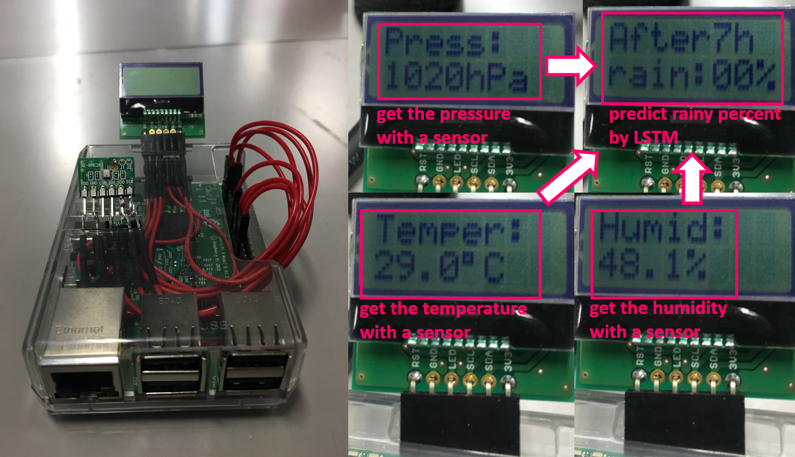

# cowling

The weather forecaster IoT with deeplearning and raspberry pi.

Cowling takes over TDU_ec_project.

## Description

First, sensor on raspi gets temperature, pressure, and humidity around sensor.
Second, raspi send captured datas to server, and then server predict today's weathre forecast as probability of raining.
Finally, display on raspi show the probability.

## Features

- Local rain forecast
- Predict future temperature, pressure, humidity
- Challenging deeplearning model

## Requirement

On server,
- Ubuntu 14.04 with GPU
- Python 3.5
- Keras 2.0

On client,
- Raspberry Pi 3
- BME-280(as a sensor)
- AE-AQM0802(as a display)
- breadboard and jumper or etc...

## Usage

    $ python RasPi_i2c_new.py

## Installation

    $ git clone https://github.com/J-Holliday/TDU_ec_project

## Author

Shohei Iida[@J-Holliday](https://digirakuda.org)

